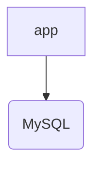

# Design Doc: Testing

# DBなど、ミドルウェアを使ったテストについて
MySQL用やredisなどのミドルウェアを使った処理のテストをする際、極力実際の動作環境に近い形で
テストを実施したいため、極力mockを使わずに行う。

ローカルなら、ローカル環境にミドルウェアのプロセスを立て、そこに繋ぐようにする

```mermaid
flowchart TD
    app --> localhost:3306(MySQL)
```

